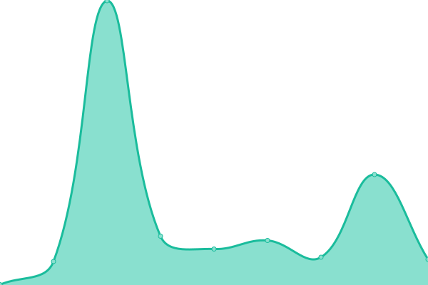

# alex-services-uptime

This repository contains the open-source uptime monitor and status page for [Alex Park](https://parkalex.dev/), powered by [Upptime](https://github.com/upptime/upptime).

<!--start: status pages-->
<!-- This summary is generated by Upptime (https://github.com/upptime/upptime) -->
<!-- Do not edit this manually, your changes will be overwritten -->
<!-- prettier-ignore -->
| URL | Status | History | Response Time | Uptime |
| --- | ------ | ------- | ------------- | ------ |
|  [parkalex.dev](https://parkalex.dev) | 🟩 Up | [parkalex-dev.yml](https://github.com/alx-alexpark/alex-services-uptime/commits/HEAD/history/parkalex-dev.yml) | 

 150ms
     
 | 

<a href="https://status.parkalex.dev/history/parkalex-dev">100.00%</a>
    

<!--end: status pages-->

## 📄 License

- Powered by: [Upptime](https://github.com/upptime/upptime)
- Code: [MIT](./LICENSE) © [Alex Park](https://parkalex.dev/)
- Data in the `./history` directory: [Open Database License](https://opendatacommons.org/licenses/odbl/1-0/)
